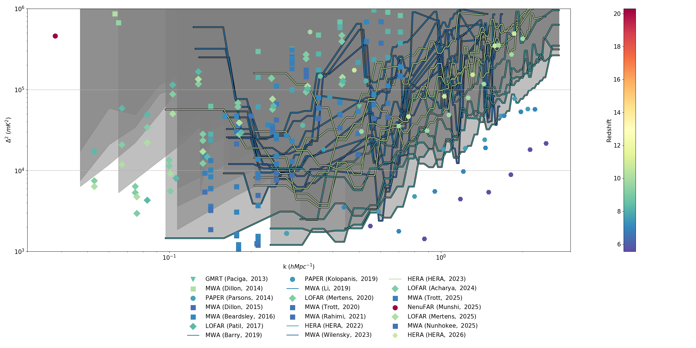

# eor-limits

`eor-limits` is a small utility that provides a compendium of published upper limits on the 21-cm power spectrum from the Epoch of Reionization (EoR) and Cosmic Dawn. It also provides functionality to plot these limits as a function of scale $k$ and redshift $z$, along with some theoretical predictions from simulations.

The published limits are included in human-readable yaml files in the data folder, and the plotting functionality is highly customizable through keywords. It is possible to read in custom yaml files to add new limits or simulations, and we welcome pull requests to add new data sets or simulations from published papers.

To use the code, check out the _Usage and examples_. For users who want to quickly explore the limits and make plots without needing to install anything, check out the new online interface: [eorlimits.streamlit.app](https://eorlimits.streamlit.app/)!



## Installation and dependencies

### User installation

* Clone the repository using ```git clone https://github.com/EoRImaging/eor_limits```

* For a simple user installation, change directories into the `eor_limits` folder and run ```pip install .``` (including the dot).

* To install without dependencies, run `pip install --no-deps .` (including the dot).

### Developer installation

* **pip installation**: Developers who would like to contribute to the code can install the package as: ```pip install -e .``` (including the dot). This will install the package in editable mode, which allows you to make changes to the code and have them immediately reflected when you import the package.

* **uv installation**: If you prefer to use `uv` to manage your environment, you can install the package in editable mode with the development dependencies using: ```uv sync --all-extras --editable```

* **Using pre-commit**: To use pre-commit to prevent committing code that does not follow our style, you'll need to run `pre-commit install` in the top level `eor_limits` directory.

* **Testing**: To run the tests, you can use the command `pytest` from the top level `eor_limits` directory. If you have `uv` installed, you can also run the tests with the development dependencies using `uv run pytest`.

* **CLI debugging**: To debug the CLI, append the environment variable `EOR_LIMITS_DEBUG=1` to the command you want to run, e.g. ```EOR_LIMITS_DEBUG=1 eor-limits plot-vs-k --out=MyPlot.pdf```. This will print out richly-formatted tracebacks instead of the high-level error messages.

## Usage and examples

There are three main ways to use `eor-limits`: through the online graphical user interface (GUI), through the Python API in a notebook or script, or through the command line interface (CLI).

### Using the online GUI

The online GUI is the quickest way to explore published limits and generate plots without installing anything locally. It is built with [Streamlit](https://streamlit.io/) and lets you select data sets, apply filters, customize the display, and download both the data and resulting figures. You can access it at [eorlimits.streamlit.app](https://eorlimits.streamlit.app/).

### Using the Python API

The Python API provides tools for loading, filtering, and plotting the included data sets. For a more complete walkthrough, see the _Tutorial notebook_. Here we just give a brief overview of how to make plots. The two main plotting functions are `plot_vs_k` and `plot_vs_z`, which show limits as a function of scale $k$ and redshift $z$, respectively. To make the default plot versus $k$, run:

```python
from eor_limits import plot_vs_k, plot_vs_z
plot_vs_k()
```

The plotting functions accept keyword arguments to choose which limits and simulations to include, customize their styles, and save the output. For example, the following code plots the HERA limits, shades the 2023 result, bolds the HERA 2026 legend item, and adds the `Mesinger2016Faint` and `Mesinger2016Bright` simulations with custom colors and shaded regions:

```python
from eor_limits import plot_vs_k, plot_vs_z
plot_vs_k(
    limits=["HERA2022", "HERA2023", "HERA2026"],
    bold_limits=["HERA2026"],
    shade_limits=True,
    base_limit_style={"linewidth": 5, "shade_alpha": 0.1},
    limit_styles={
        "HERA2023": {"shade_alpha": 0.25, "shade_color": "C1"}
    },
    theories=["Mesinger2016Faint", "Mesinger2016Bright"],
    shade_theories=True,
    base_theory_style={"linestyle": "-."},
    theory_styles={
        "Mesinger2016Faint": {"color": "C3", "shade_alpha": 0.5, "shade_color": "C3"},
        "Mesinger2016Bright": {"color": "C4", "shade_alpha": 0.1, "shade_color": "C4"}
    },
    out="MyPlot.pdf"
)
```

### Using the CLI

After installation, you can use the `eor-limits` command to make plots from the terminal. Run `eor-limits -h`, `eor-limits plot-vs-k -h`, or `eor-limits plot-vs-z -h` to see the available options.

For the default plot of all limits as a function of scale $k$, run:

```bash
eor-limits plot-vs-k --out=MyPlot.pdf
```

The CLI exposes the same plotting options as the Python API. Dictionary-style options, such as custom limit or theory styles, can be passed as JSON strings:

```bash
eor-limits plot-vs-k \
    --limits HERA2022 HERA2023 HERA2026 \
    --bold-limits HERA2026 \
    --shade-limits \
    --base-limit-style '{"linewidth": 5, "shade_alpha": 0.1}' \
    --limit-styles '{"HERA2023": {"shade_alpha": 0.25, "shade_color": "C1"}}' \
    --theories Mesinger2016Faint Mesinger2016Bright \
    --shade-theories \
    --base-theory-style '{"linestyle": "-."}' \
    --theory-styles '{"Mesinger2016Faint": {"color": "C3", "shade_alpha": 0.5, "shade_color": "C3"},
                     "Mesinger2016Bright": {"color": "C4", "shade_alpha": 0.1, "shade_color": "C4"}}' \
    --out MyPlot.pdf
```

## Community guidelines

### Contributing to the repository

We welcome contributions to this repository from the community. If you would like to contribute, please follow these guidelines:

* If you would like to add new data sets or simulations, ensure that they come from peer-reviewed published papers and make a pull request to add them to the repository (see _Developer Installation_ for information on how to set up your environment). The data should be added in the form of a YAML file in the data folder, following the format of the existing files:
    ```yaml
    telescope: GMRT
    author: Paciga
    year: 2013
    doi: 10.1093/mnras/stt753
    data:
        delta_squared: [[6.15e4]]
        k: [[0.5]]
        z: [8.6]
    ```

* If you would like to plot or compare unpublished data, you can create a local YAML file and load it in the code using  `DataSet.load("/path/to/my_data.yaml")`.

* If you would like to report a bug or request a feature, please file an issue on the github repository.

### License

This code is fully open-source, available under BSD 2-Clause License. See the LICENSE file for more details.  Please feel free to use and modify the code as needed.
