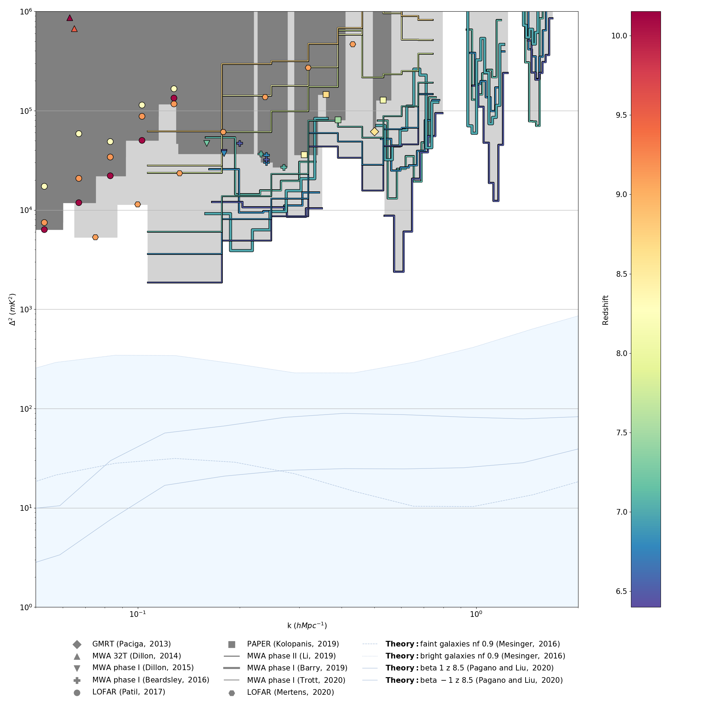

# eor-limits

`eor-limits` is a small utility defining a format for 21cm upper limits and plotting them.

The primary functionality is to plot published limits and simulations as a
function of k and redshift. The data for the plots is included in human-readable
yaml files in the data folder, so adding new data or theory lines is as simple
as putting the data in a yaml file and placing it in the data directory.

We aim to continually update the repository to include all published limits in the field.
The goal is to make it easier for experimentalists and theorists to add their own data
or simulations and quickly compare on a 'standard' plot.

This code snippet is fully open source (BSD). Feel free to use the resulting plots in
papers or presentations as you see fit.

We show a sample plot below, the appearence is highly customizable through keywords.



# Community Guidelines
We welcome pull requests to add new data sets or simulations. We require that
data and simulations come from peer-reviewed published papers. If you would
like to add unpublished data or simulations to a plot, please fork this
repository and add the data or simulations in your fork. If the data or
simulations are subsequently published we welcome a pull request from your
fork to add them to this repository.

We also welcome bug reports or feature requests, please file them as issues
on the github repository.

# Installation
Clone the repository using
```git clone https://github.com/EoRImaging/eor_limits```

For a simple user installation, change directories into the `eor_limits` folder and
run ```pip install .``` (including the dot).

To install without dependencies, run `pip install --no-deps .` (including the dot).

Developers who would like to contribute to the code should follow
the directions under [Developer Installation](#developer-installation) below.

## Dependencies

If you prefer to manage dependencies manuallly, you will
need to install the following dependencies.

* numpy
* matplotlib
* pyyaml

## Developer Installation

Clone the repo and install the package and its development dependencies, e.g. with `pip`:

```pip install -e .[dev]```

or with `uv`:

```uv sync --all-extras```

To use pre-commit to prevent committing code that does not follow our style, you'll
need to run `pre-commit install` in the top level `eor_limits` directory.

# Making plots

You can either use the CLI or library -- or even the [online interface](https://eorlimits.streamlit.app/)!

## CLI

After installation, use `eor-limits plot` from the CLI to make the default
plot (including all the papers in the data folder). There are a number of
options to customize the plot, use ```eor-limits plot --help```
to see the various options.

For example, ```eor-limits plot --bold barry_2019 kolopanis_2019 li_2019``` would
bold the references to the papers published in 2019.


## Notebook

Alternatively, to make the plot within an interactive environment like a
Jupyter notebook, run:

```
from eor_limits import plot_vs_k
plot_vs_k()
```
and the plot should appear inline.
