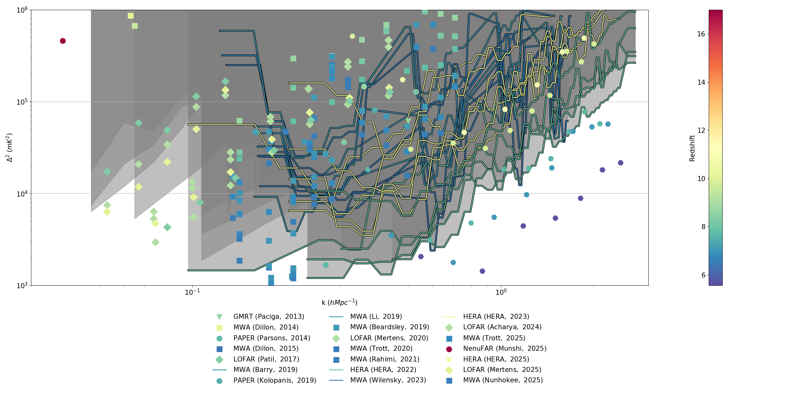

# eor-limits

`eor-limits` is a small utility that provides a compendium of published
upper limits on the 21-cm power spectrum from the Epoch of Reionization (EoR)
and Cosmic Dawn. It also provides functionality to plot these limits as a function of scale $k$ and redshift $z$, along with some theoretical predictions from simulations.

The published limits are included in human-readable yaml files in the data folder, and the plotting functionality is highly customizable through keywords. It is possible to read in custom yaml files to add new limits or simulations, and we welcome pull requests to add new data sets or simulations from published papers.

Before you dive in, check out the brand new [online interface](https://eorlimits.streamlit.app/) to explore the limits and make plots without needing to install anything!



## Installation and dependencies

### User installation

* Clone the repository using
```git clone https://github.com/EoRImaging/eor_limits```

* For a simple user installation, change directories into the `eor_limits` folder and
run ```pip install .``` (including the dot).

* To install without dependencies, run `pip install --no-deps .` (including the dot).

### Developer installation

* Developers who would like to contribute to the code can install the package as: ```pip install -e .[dev]``` (including the dot). This will install the package in editable mode, which allows you to make changes to the code and have them immediately reflected when you import the package. It will also install the development dependencies, which include tools for testing and formatting the code.

* If you prefer to use `uv` to manage your environment, you can install the package in editable mode with the development dependencies using: ```uv sync --all-extras --editable .```

* To use pre-commit to prevent committing code that does not follow our style,
you'll need to run `pre-commit install` in the top level `eor_limits` directory.


### Dependencies

If you prefer to manage dependencies manually, you will
need to install the following packages:

* cattrs>=25.3.0
* cyclopts>=4.5.1
* h5py>=3.15.1
* matplotlib>=3.10.8
* numpy>=2.4.1
* pandas>=3.0.0
* pyyaml>=6.0.3
* rich>=14.3.1

## Usage and examples

There are three main ways to use the code: as a library within a notebook or python script, through the command line interface (CLI), or through the [online interface](https://eorlimits.streamlit.app/).

### Using the library

The library allows you to load, slice and dice the data in various ways, and also includes plotting functionality. For a detailed tutorial on how to use the library, see the Notebooks. Here we just give a brief overview of how to make plots. To make the default plot of all the limits as a function of scale $k$, run:

```python
from eor_limits import plot_vs_k
plot_vs_k()
```

A more customized plot can be made by using the various options. For example, in order to plot the HERA2023 limit with a thicker line and a shaded region, and to plot the Mesinger2016Faint and Mesinger2016Bright simulations with different colors and shaded regions:

```python
from eor_limits import plot_vs_k
plot_vs_k(
    limits=["HERA2022", "HERA2023", "HERA2026"],
    bold_limits=["HERA2026"],
    shade_limits=True,
    base_limit_style={"linewidth": 5, "shade_alpha": 0.1},
    limit_styles={
        "HERA2023": {"shade_alpha": 0.25, "shade_color": "C1"}
    },
    theories=["Mesinger2016Faint", "Mesinger2016Bright"],
    shade_theories=True,
    base_theory_style={"linestyle": "-."},
    theory_styles={
        "Mesinger2016Faint": {"color": "C3", "shade_alpha": 0.5, "shade_color": "C3"},
        "Mesinger2016Bright": {"color": "C4", "shade_alpha": 0.1, "shade_color": "C4"}
    },
    out="MyPlot.pdf"
)
```

### Using the CLI

After installation, you can use the `eor-limits` command from the terminal to make plots. In the terminal, you can run ```eor-limits -h``` or ```eor-limits plot-vs-k -h``` to see the various options for customizing the plot. The CLI provides the same functionality as the library, but allows you to make plots without needing to write any code. For the default plot of all the limits as a function of scale $k$, you can simply run:

```bash
eor-limits plot-vs-k --out=MyPlot.png
```

To make the same customized plot as in the library example, you can run:

```bash
eor-limits plot-vs-k \
    --limits=HERA2022 HERA2023 HERA2026 \
    --bold-limits=HERA2026 \
    --shade-limits \
    --base-limit-style.linewidth=5 \
    --base-limit-style.shade_alpha=0.1 \
    --limit-styles.HERA2023.shade_alpha=0.25 \
    --limit-styles.HERA2023.shade_color='C1' \
    --theories=Mesinger2016Faint Mesinger2016Bright \
    --shade-theories \
    --base-theory-style.linestyle='-.' \
    --theory-styles.Mesinger2016Faint.color='C3' \
    --theory-styles.Mesinger2016Faint.shade_alpha=0.5 \
    --theory-styles.Mesinger2016Faint.shade_color='C3' \
    --theory-styles.Mesinger2016Bright.color='C4' \
    --theory-styles.Mesinger2016Bright.shade_alpha=0.1 \
    --theory-styles.Mesinger2016Bright.shade_color='C4' \
    --out MyPlot.pdf
```

### Using the online interface

We have also created an online interface to make it easy for users to explore the limits and make plots without needing to install anything. You can access the online interface at [https://eorlimits.streamlit.app/](https://eorlimits.streamlit.app/). The online interface allows you to select which limits to include in the plot, filter them in various ways, and download the data and the plot.

## Community guidelines

### Contributing to the repository

We welcome contributions to this repository from the community. If you would like to contribute, please follow these guidelines:

* If you would like to add new data sets or simulations, ensure that they come from peer-reviewed published papers and make a pull request to add them to the repository (see Developer Installation for how to set up your environment).

* If you would like to add unpublished data or simulations to a plot, please fork this repository and add the data or simulations in your fork. If the data or simulations are subsequently published we welcome a pull request from your fork to add them to this repository.

* If you would like to report a bug or request a feature, please file an issue on the github repository.

### License

This code is fully open-source, available under BSD 2-Clause License. See the LICENSE file for more details.  Please feel free to use and modify the code as needed.
