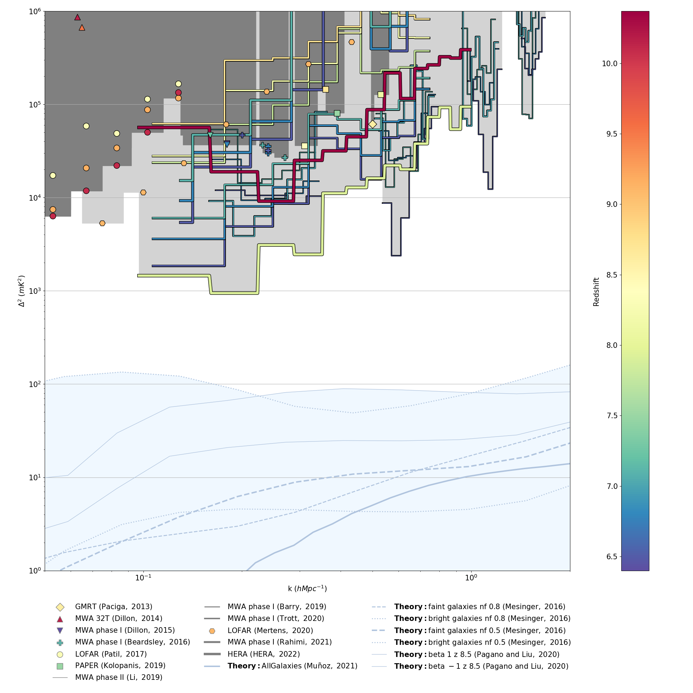

# eor_limits

eor_limits is a small utility for plotting EoR Limits.

The primary functionality is to plot published limits and simulations as a
function of k and redshift. The data for the plots is included in human-readable
yaml files in the data folder, so adding new data or theory lines is as simple
as putting the data in a yaml file and placing it in the data directory.

We aim to continually update the repository to include all published limits in the field.
The goal is to make it easier for experimentalists and theorists to add their own data or simulations and
quickly compare on a 'standard' plot.

This code snippet is fully open source (BSD). Feel free to use the resulting plots in papers or presentations as you see fit.

We show a sample plot below, the appearence is highly customizable through keywords.



# Community Guidelines
We welcome pull requests to add new data sets or simulations. We require that
data and simulations come from peer-reviewed published papers. If you would
like to add unpublished data or simulations to a plot, please fork this
repository and add the data or simulations in your fork. If the data or
simulations are subsequently published we welcome a pull request from your
fork to add them to this repository.

We also welcome bug reports or feature requests, please file them as issues
on the github repository.

# Installation
Clone the repository using
```git clone https://github.com/EoRImaging/eor_limits```

For a simple user installation, change directories into the `eor_limits` folder and run ```pip install .``` (including the dot).

To install without dependencies, run `pip install --no-deps .` (including the dot).

Developers who would like to contribute to the code should follow
the directions under [Developer Installation](#developer-installation) below.

## Dependencies
If you prefer to manage dependencies outside of pip (e.g. via conda), you will
need to install the following dependencies.

* numpy
* matplotlib
* pyyaml

## Developer Installation
First, clone the repository as described above. In order to do development on the code,
you will need several additional dependencies.

If you want pip to manage your dependencies, navigate into the pyuvdata directory and
run `pip install .[dev]` (note that `python setup.py install` does not work).

If you use anaconda or another package manager you might prefer to first install
the dependencies listed in [Dependencies](#dependencies) along with the following
developer specific dependencies:

* pytest
* pytest-cov
* coverage
* pre-commit

Or you can use the included `environment.yaml` file to create a new environment that will
contain all the dependencies required for testing and development (```conda env create -f environment.yaml```).

Then install without pip managing dependencies using `pip install --no-deps .` (including the dot).

To use pre-commit to prevent committing code that does not follow our style, you'll need to run `pre-commit install` in the top level `eor_limits` directory.

# Making the plots

You can use the software either directly from the UNIX command line (pdf output), or from within a python notebook (inline figure).

## Command Line

After installation, call the plotting script as ```plot_eor_limits.py``` from the command line to make the default
plot (including all the papers in the data folder). There are a number of
options to customize the plot, use ```plot_eor_limits.py --help```
to see the various options.

For example, ```plot_eor_limits.py --bold barry_2019 kolopanis_2019 li_2019``` would bold the references to the papers published in 2019.


## Notebook

Alternatively, to make the plot within an interactive environment like a
Jupyter notebook, run:
```
import eor_limits
eor_limits.make_plot()
```
and the plot should appear inline

To see the options type ```eor_limits.make_plot?``` in the environment. For example ```eor_limits.make_plot(bold_papers='barry_2019 kolopanis_2019 li_2019')``` would bold the references to the papers published in 2019.
